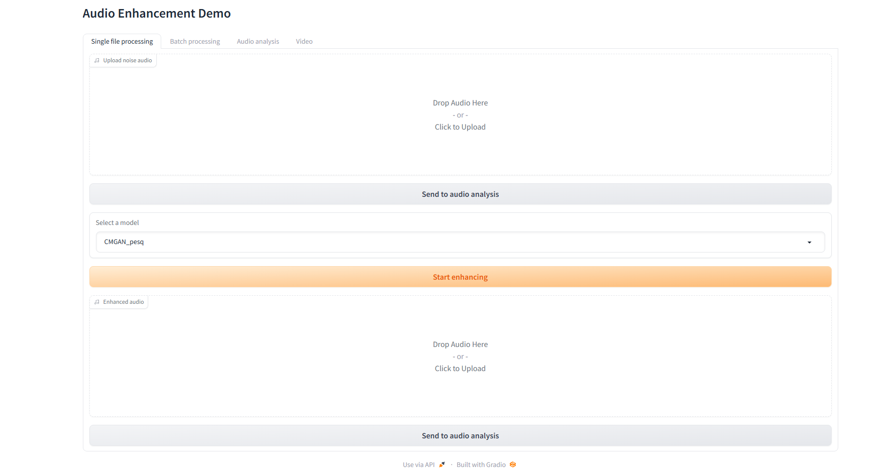

# Speech Enhancement Based On Deep Neural Networks

## WebUI
To improve accessibility and enable intuitive interaction with the speech enhancement system, a WebUI was developed using the Gradio framework. 

## Code reference: https://github.com/ruizhecao96/CMGAN

## Paper: https://ieeexplore.ieee.org/document/10508391

### How to start
**1. Prepare the necessary libraries:** 

`pip install -r requirements.txt`

**2. Launch**

In the terminal, use command:
``` python WebUI.py ```

**3. Click the link to launch (on local browser)**

You will see this interface. Drop the audio to the box or click the box to upload audio.
Then choose a model you want and click "Start enhancing". Wait a few seconds, and the enhanced audio will appear. Have a good experience !


### Project outline:
* -AudioSamples: Clean and noisy audio samples.
* -checkpoints: Models for denosing.
* -models: The components of the CMGAN model and the attention module.
* -requirements.txt: Configure the environment required for the project.
* -WebUI.py: Code for building the user interface. 
